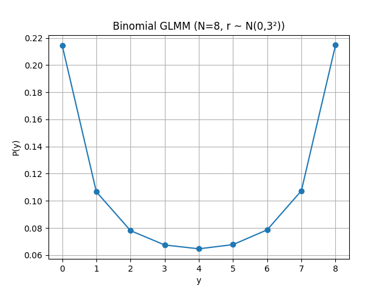
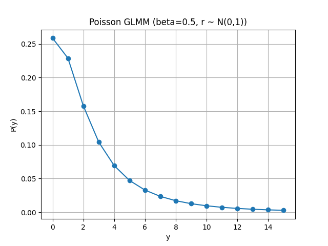
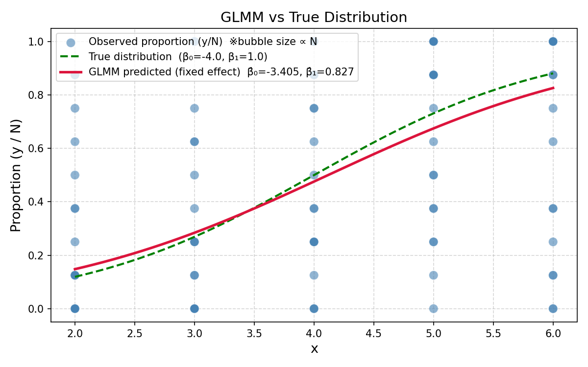
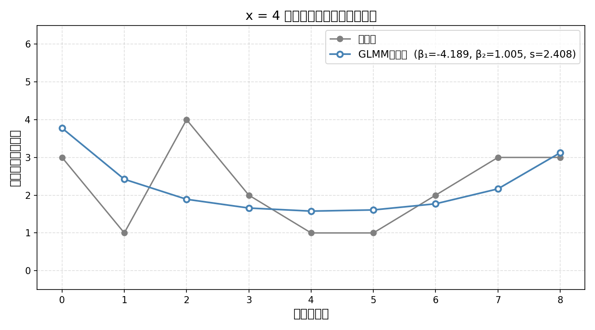

```shell
 pip install matplotlib  
 pip install scipy
 pip install numpy    
```

https://kuboweb.github.io/-kubo/ce/IwanamiBook.html
のglmmフォルダのdata.csvを見る

### 7.4 一般化線形混合モデルの最尤推定
#### 二項分布 と N(0,1)の混合
Binomial GLMM（N=8, logitリンク, ランダム効果 𝑟 ∼ 𝑁(0 , 3 ^2))）

線形予測子は

\eta = r

確率変換は

q = \frac{1}{1+e^{-r}}

条件付き分布は

Y\mid r \sim \mathrm{Binomial}(8,q)

ランダム効果は

r \sim N(0,3^2)

[
P(Y=y)=\int \binom{8}{y}q(r)^y(1-q(r))^{8-y}\phi(r),dr
]
をモンテカルロ近似して求まる。


#### Poisson と N(0,1)の混合



```markdown
推定値  β̂₀ = -3.4046  (真値 -4.0)
推定値  β̂₁ = 0.8268  (真値 1.0)
切片の誤差: +0.5954
傾きの誤差: -0.1732
```
#### 
pymer4はRのlme4をPythonから呼ぶラッパー を使わないときれいに書けないかも。



### Rのインストール
```shell
brew install cmake
```
```shell
brew install r
R -e "install.packages('nloptr', repos='https://cloud.r-project.org', type='source')"
```
上が通ったら lme4 → lmerTest の順に
```shell
R --version
pip install pymer4
R -e "install.packages('lme4', repos='https://cloud.r-project.org')"
R -e "install.packages('lmerTest', repos='https://cloud.r-project.org')"
```

```shell
pip install pymer4
pip install polars
pip install rpy2
pip install joblib
```

```shell
sudo mkdir -p /Library/Frameworks/R.framework/Versions/4.5-arm64/Resources/lib
```

```shell
sudo ln -s /opt/homebrew/Cellar/r/4.5.3/lib/R/lib/libR.dylib /Library/Frameworks/R.framework/Versions/4.5-arm64/Resources/lib/libR.dylib
sudo ln -s /opt/homebrew/Cellar/r/4.5.3/lib/R/lib/libRlapack.dylib /Library/Frameworks/R.framework/Versions/4.5-arm64/Resources/lib/libRlapack.dylib
```
```shell
sudo ln -s /opt/homebrew/Cellar/r/4.5.3/lib/R/lib/libRlapack.dylib /Library/Frameworks/R.framework/Versions/4.5-arm64/Resources/lib/libRblas.dylib
```
```markdown
# 旧バージョンの書き方
# from pymer4.models import Lmer
```
```shell
python -c "from pymer4.models import lmer; print(dir(lmer))"
```
でクラス名確認する

Rでやると、
β₁ = -4.1893
β₂ = 1.0047
s  = 2.4080